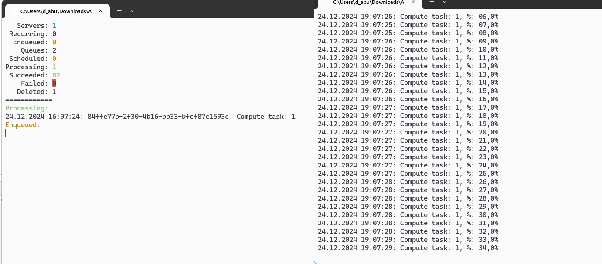

# Программа Ping-Pong с использованием MPI

Данная программа демонстрирует использование библиотеки MPI (Message Passing Interface) для реализации простого взаимодействия между процессами в распределенной среде. Программа выполняет обмен сообщениями между процессами, где процесс с рангом 0 отправляет сообщение "Ping!" всем остальным процессам, а те отвечают сообщением "Pong!".

## Описание

Программа состоит из одного класса `PingPong`, в котором реализована основная логика взаимодействия между процессами. Каждый процесс выполняет следующие действия:

- Процесс с рангом 0 отправляет сообщение "Ping!" всем другим процессам.
- Каждый из остальных процессов принимает сообщение и отвечает своим именем хоста.
- Процесс с рангом 0 выводит информацию о каждом процессе, который ответил.

## Установка

1. Убедитесь, что у вас установлен .NET SDK (версии 5.0 или выше).
2. Установите библиотеку MPI. Если вы используете NuGet, выполните следующую команду в консоли:

   ```
   dotnet add package MPI
   ```

## Запуск программы

1. Скомпилируйте проект с помощью команды:

   ```
   dotnet build
   ```

2. Запустите программу с использованием MPI. Например, если вы используете `mpiexec`, выполните команду:

   ```
   mpiexec -n <number_of_processes> dotnet run
   ```

   Замените `<number_of_processes>` на количество процессов, которые вы хотите запустить (например, 4).

## Пример вывода

При запуске программы вы можете увидеть следующий вывод (в зависимости от количества процессов):

```
Rank 0 is alive and running on <hostname_0>
Pinging process with rank 1... Pong!
 Rank 1 is alive and running on <hostname_1>
Pinging process with rank 2... Pong!
 Rank 2 is alive and running on <hostname_2>
Pinging process with rank 3... Pong!
 Rank 3 is alive and running on <hostname_3>
```

## Используемые технологии

- C#
- .NET SDK
- MPI (Message Passing Interface) для межпроцессного взаимодействия

## Скрины работы:
