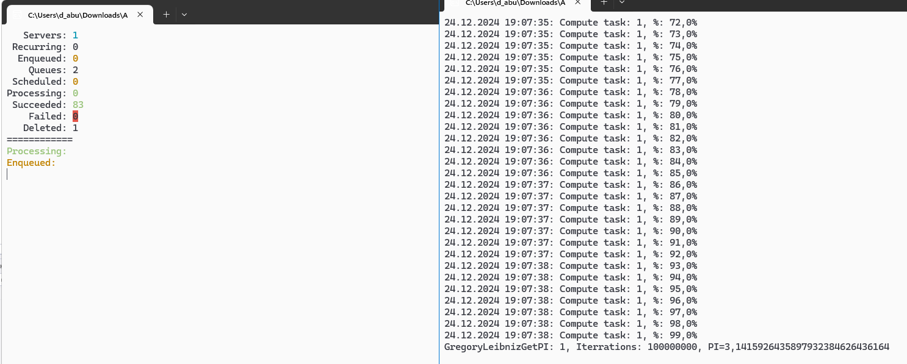

```markdown
# Программа для управления фоновыми задачами с использованием Hangfire и Redis

Данная программа демонстрирует использование библиотеки Hangfire для управления фоновыми задачами в приложении на C#. Она использует Redis в качестве хранилища для очередей задач и предоставляет интерфейс командной строки для управления задачами.

## Описание

Программа позволяет:

- Добавлять фоновые задачи для вычислений.
- Отменять запланированные задачи.
- Просматривать статистику выполнения задач, включая количество запущенных, завершенных и неудачных задач.

### Основные функции

- **Добавление задач**: Нажмите `N` для добавления задачи вычисления, или `P` для добавления задачи вычисления числа Пи.
- **Отмена задач**: Нажмите `C`, чтобы отменить задачу, после чего введите идентификатор задачи.
- **Выход из программы**: Нажмите `Escape`.

## Установка

1. Убедитесь, что у вас установлен .NET SDK (версии 5.0 или выше).
2. Установите Redis на вашем компьютере или используйте облачный сервис Redis.
3. Скопируйте код в новый проект C#.

### Установка зависимостей

Добавьте необходимые пакеты NuGet:

```
dotnet add package Hangfire
dotnet add package Hangfire.Redis.StackExchange
dotnet add package StackExchange.Redis
```


## Пример вывода

При запуске программы вы увидите информацию о текущих задачах и статистику:

```
Servers:        1
Recurring:      0
Enqueued:       5
Queues:         1
Scheduled:      0
Processing:     2
Succeeded:      3
Failed:         0
Deleted:        0
=============
Processing:
2024-12-24T19:00:00Z: job_id_1. Compute task: 1
Enqueued:
2024-12-24T19:01:00Z: job_id_2. State=Enqueued. Compute task: 2
```

## Используемые технологии

- C#
- .NET SDK
- Hangfire для управления фоновыми задачами
- Redis как хранилище задач

## Скрины работы



